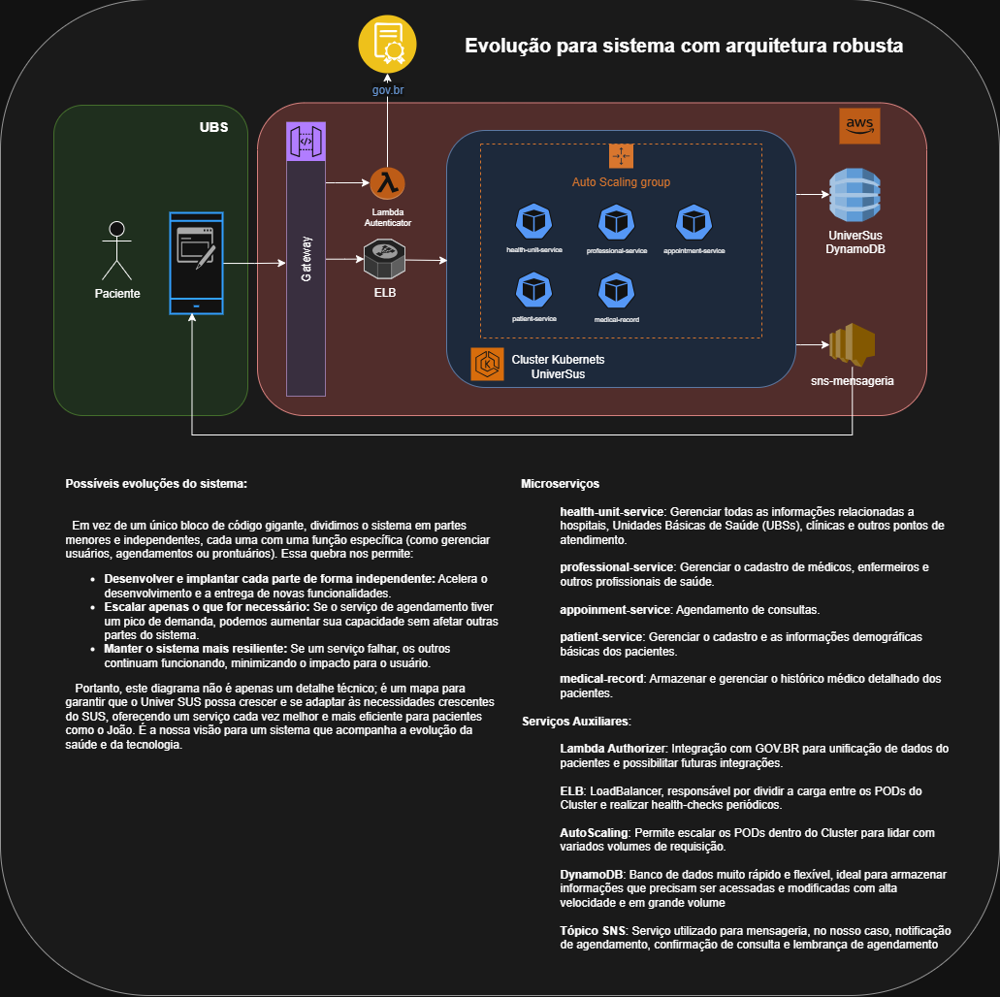

# universus-gerenciador-reserva

Uma API MVP para gerenciamento de reservas, construída com foco em **Clean Architecture** para garantir alta coesão, baixo acoplamento, testabilidade e manutenibilidade. A aplicação utiliza **Spring Boot** e é conteinerizada com **Docker**, facilitando a implantação em qualquer ambiente.

---

## ✨ Recursos Principais

* **Gerenciamento de Reservas:** Crie, consulte e gerencie reservas de forma eficiente.
* **Gestão de Médicos:** Cadastro e consulta de informações de médicos.
* **Validação de CRM:** Validação rigorosa do formato de CRM para garantir a integridade dos dados dos médicos.
* **Organização por Camadas:** Segue os princípios da Clean Architecture, separando claramente as preocupações (domínio, aplicação, adaptadores e infraestrutura).
* **Conteinerização:** Pronta para rodar em ambientes Docker com `Dockerfile` e `docker-compose.yaml`.
* **Migrações de Banco de Dados:** Utiliza Flyway para controle de versão do schema do banco de dados.

---

## 🛠️ Tecnologias Utilizadas

* **Linguagem:** Java 21
* **Framework:** Spring Boot 3.5.3
* **Banco de Dados:** PostgreSQL
* **Conteinerização:** Docker, Docker Compose
* **Ferramenta de Build:** Maven
* **Testes:** JUnit 5, Mockito
* **Migrações de DB:** Flyway

---

## 🏛️ Arquitetura

Este projeto adota a **Clean Architecture**, dividindo a aplicação em camadas bem definidas e independentes:

* `domain/models`: Contém as entidades de negócio puras (`Reserva`, `Medico`) e suas regras essenciais, sem depender de frameworks externos.
* `application/usecases`: Define a lógica de negócio específica da aplicação , orquestrando as operações do domínio e interagindo com os *gateways*.
* `application/gateways`: Interfaces (portas) que o `usecase` usa para interagir com o mundo externo (e.g., `ReservaRepository`, `MedicoRepository`).
* `adapter/controller`: Adaptadores de interface (controladores REST) que recebem requisições externas e as traduzem para o formato que os `usecases` esperam.
* `adapter/dto`: Data Transfer Objects (DTOs) usados para comunicação entre as camadas de interface e aplicação.
* `adapter/mapper`: Mappers responsáveis por converter DTOs para entidades de domínio e vice-versa.
* `infra/persistence`: Adaptadores de infraestrutura (repositórios JPA) que implementam os *gateways* da aplicação, interagindo diretamente com o banco de dados.
* `infra/config`: Classes de configuração para injeção de dependências e outros componentes.
* `infra/exceptions`: Exceções customizadas e tratadores globais de exceções.

Essa estrutura garante que as regras de negócio permaneçam independentes de tecnologias e frameworks externos, facilitando a manutenção e evolução do sistema.

---

## 🚀 Como Montar e Rodar a Aplicação

Para rodar a aplicação, você precisará ter o **Docker** e o **Docker Compose** instalados em sua máquina.

### 1. Clonar o Repositório

```bash
git clone https://github.com/EvaldoFires/universus-gerenciador-reserva.git
cd universus-gerenciador-reserva 
```

### 2. Construir e Iniciar Aplicação com Docker Compose

O docker-compose.yaml neste projeto já está configurado para levantar o banco de dados PostgreSQL e a aplicação API.

```bash
docker-compose up -d
```

### 3. Acessar a Aplicação

Após os serviços subirem (pode levar alguns minutos na primeira vez para baixar imagens e construir), a API estará disponível em:
http://localhost:8080

### 4. Postman

dentro do repositorio do projeto existe uma past "docs" contendo o arquivo UniverSUS.postman.json que pode ser importado para dentro do postman para facilitar as chamadas dos endpoints da aplicação.

### 5. Arquitetura Inicial - MVP


### 6. Evolução 



